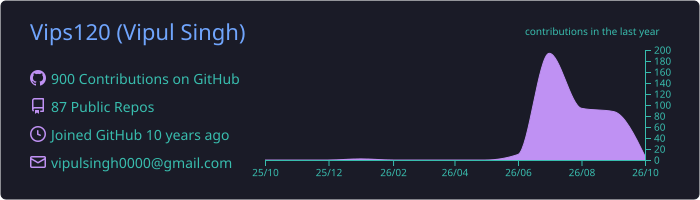
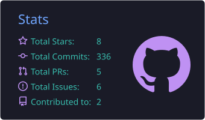
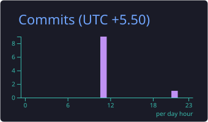

  

  
  
  
  

---

### 🧑‍💻 About me

- 💼 **10+ years** in IT: enterprise software, modern web platforms, freelance projects and technical training
- 🤖 Focused on **AI-first development**, developer productivity and shipping my own products
- 🌐 Web: **Next.js, React, Vue.js, Angular, Node.js, Express, GraphQL, MongoDB**
- 📱 Mobile: **Kotlin** (native Android) and **Flutter**
- 👨‍🏫 Former technical trainer: Angular, React, Node, Express and MongoDB
- 📍 Thane, Maharashtra, India · 🤝 open to freelance and collaboration

### 🚀 What I'm building

<table>
  <tr>
    <td width="50%" valign="top">
      <h3>🧰 <a href="https://www.forgeplug.com/">ForgePlug</a></h3>
      Free, fast, browser-based utility tools, no sign-up needed.  
      
      
      
    </td>
    <td width="50%" valign="top">
      <h3>📦 Ownary</h3>
      Private, offline-first Android app to track the things you own and their warranties.  
      
      
      
    </td>
  </tr>
  <tr>
    <td width="50%" valign="top">
      <h3>🐾 DaliCircle</h3>
      An app for pet parents to manage their pets' care.  
      
      
      
    </td>
    <td width="50%" valign="top">
      <h3>🛡️ VulnSight</h3>
      Continuous web application security monitoring and vulnerability management.  
      
      
      
    </td>
  </tr>
</table>

### 🛠️ Tech stack

   
  

### 🤖 AI tools I use

  
  
  
  
  
  
  
  

### 📊 GitHub activity

  

  
  

  

  <picture>
    <source media="(prefers-color-scheme: dark)" srcset="https://raw.githubusercontent.com/Vips120/Vips120/output/snake-dark.svg" />
    <source media="(prefers-color-scheme: light)" srcset="https://raw.githubusercontent.com/Vips120/Vips120/output/snake.svg" />
    
  </picture>

  

